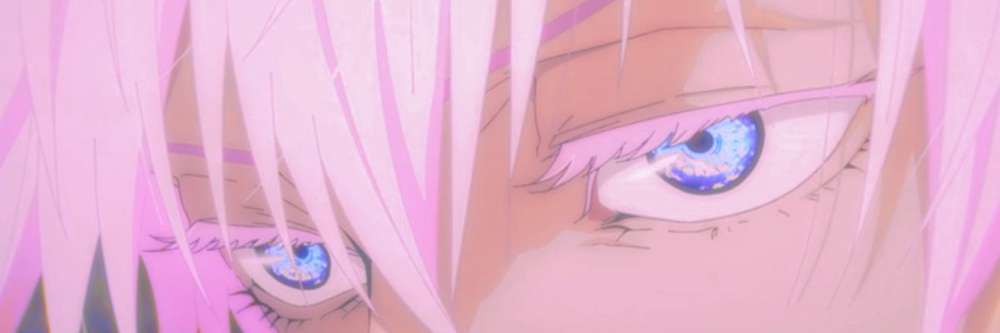

# ˚.⋆꒰১ lunaella ໒꒱⋆.˚

### Full-Stack · AI Engineer · Graphic Designer

 

## let's connect! 𓏲 ๋࣭ ࣪ ˖🎐

 

## ⋆˚✿ about 🍒𐙚⋆˚

hey, i'm mikee! just someone who likes turning random ideas into cool little projects. i'm currently into embedded programming and ai, learning as i go, breaking things occasionally, and somehow making them work again.

when i'm not staring at my screen, i'm probably taking film photos outside.

still figuring it all out, but we move.

 

## tech stack 🪽་༘࿐

 

 

 

## analytics 𖦹🍀୭˚ᵎ｡𖦹°‧

 

## 𝄞⨾💿 contribution ✮˚.⋆

 

## a letter from snoopy ⋆⭒˚.⋆ ݁💌

> *"If you think about something at three o'clock in the morning and then again at noon the next day, you get different answers."*

 

## featured 🪼⋆.ೃ࿔*:･

**[hospital-web-dashboard](https://github.com/lunaella/hospital-web-dashboard)** — ResQ blood donation admin dashboard
  

**[hand-painting](https://github.com/lunaella/hand-painting)** — draw in the air using hand gestures
  

**[blkchain](https://github.com/lunaella/blkchain)** — blockchain fundamentals in Java
  

**[osacha](https://github.com/lunaella/osacha)** — SwiftUI ordering app for a matcha café
  

 

